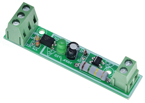
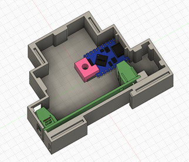
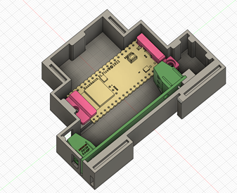
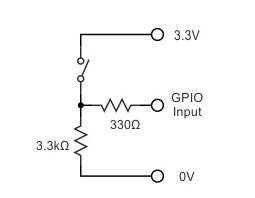
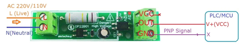

# griddetector

griddetector is a telegram bot written in micropython.

Verified on Raspberry Pi Pico W and ESP32-S3, but also should work on any board supported by micropython.

Monitors the state of the external Grid line using a GPIO pin connected to the dry contact of the relay powered by a direct Grid line.

Sends notifications to telegram chat about Grid state changes, together with some statistics.

Applicable mainly in Ukraine with planned grid outages, however, can be used in any location, but you need to modify the code to exclude not needed functionality.

## Hardware

I've tried the following controllers:
- Raspberry Pi PICO W https://www.raspberrypi.com/products/raspberry-pi-pico/
- Waveshare ESP32-S3-ZERO https://www.waveshare.com/esp32-S3-zero.htm
- Waveshare ESP32-S3-NANO https://www.waveshare.com/esp32-s3-nano.htm

As a relay, I use a 1-bit optocoupler you can easily find on Aliexpress for around 1$.

Also, I've made some custom DIN-mounted boxes for the first two controllers, so you can print one (or modify on your own).

Printable 3D Models can be found here: https://www.thingiverse.com/thing:6745416

## Wiring

Connect the normal open dry contact of the relay using a pull-down circuit, so when the relay is powered by the grid line - the pin goes `HIGH`.

The optocoupler needs to be connected like this:

## Installation

1. Install micropython on your board
2. Copy all files to the device's flash
3. Modify boot.py to connect to your WiFi network, specify the hostname.
4. Modify webrepl_cfg.py to protect your WebREPL with the password.
5. Modify the DTEK schedule by modifying export_jsons.py and executing it after modification, or directly in respective jsons
6. Modify settings in main.py to match your setup

## Usage

Reboot the device and enjoy.

## Contributing

For major changes, please open an issue first to discuss what you would like to change.

## License

Щастя для всіх, задарма, і нехай ніхто не піде обділений!